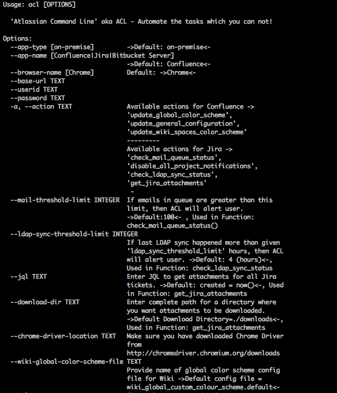

# Automate Atlassian from Command Line (ACL)
Please refer to branch *python-3.x-compatible-up-to-date-branch* as it has latest content!

## Entry to _Atlassian Codegeist Hackathon 2015_: http://devpost.com/software/atlassian-command-line



## What it does
We are going to use Python, Selenium along with Chrome Browser to just automate anything that you like. 
> * Automate On-premise JIRA / Confluence instances.
> * Use headless browser such as Chrome to achieve automation at regular intervals
> * Automate administration / user tasks across all Atlassian applications (current focus limited to JIRA and Confluence though)
> * Automate multiple actions from single command _(just add --action = x, --action = y)_

#### JIRA Tasks Automation
_(--app-name = Jira)_
* Disable notification schemes for all projects **--action = disable_project_notification_schemes**
* Mail Queue health check **--action = check_jira_mail_queue_status**
* LDAP sync status **--action = check_ldap_sync_status**
* Download attachments for all issues as per JQL **--action = get_jira_attachments**
* Add / update list of options associated to Selectfield (Will not be available, instead use Customfield Editor plugin for Jira)

#### Confluence Automation
_(--app-name = Confluence)_
* Update Global color scheme **--action = update_global_color_scheme**
* Update color scheme for all Wiki spaces **--action = update_wiki_spaces_color_scheme**
* Update general configuration **--action = update_general_configuration**

# Usage instructions
## Usage instructions of Jupyter Notebook (atlassian_command_line.ipynb)
* This notebook is updated to make sure all functionality that I earlier worked on for 2015 Codegist works on Python 3 too.
* I also realized that in my new company, I can't run it as a command line because of Single Sign On integration and having to do Fast Pass such as finger scan.
* Being lazy, I've make the module work as Jupyter Notebook.
* Make sure you have config/ available in your repo.
* .env.stage, .env.dev etc environment files are available with information such as APP_URL, REST_APP_URL and BEARER_TOKEN
*  Also make sure you have environment files available. Below is one such example
```
* ❯ cat .env.stage
* APP_URL=<Base Jira URL>
* REST_API_APP_URL=<This can be same as APP_URL otherwise different REST API END Point needs to be mentioned>
* BEARER_TOKEN=<enter your token aka PAT>
```
* Make sure you have virtual environment created.
* TO DO: add requirements.txt so that all libaries can be installed by user.
* I use Selenium | https://www.selenium.dev/selenium/docs/api/py/api.html
* Click, dotenv and requests library.
* One last thing to do is setting up the environment so that correct files are picked.
** For that you need to setup env_type variable after you run the Jupyter Notebook environment (jupyter lab)
* Run first three cells as mentioned in the documentation for these cells.
* Rest of the cells shows how you can perform four operations like LDAP Sync Status, Mail Queue Status check, Global Look & Feel update and Disabling all projects notification schemes.
* Hope that works for you. Let me know how it goes!
#
## How to use this Add On
* Clone source from [Atlassian Command Line](https://github.com/rkadam/atlassian_command_line) git repository
* Install WebDriver for Chrome [ChromeDriver](http://chromedriver.chromium.org/downloads)
* Install [Virtual Environment](http://docs.python-guide.org/en/latest/dev/virtualenvs/)
* create virtual environment for python 3+ -> _virtualenv -p /usr/bin/python2.7 venv_
* Install "Atlassian Command Line" as a python module -> _pip install --editable ._
* _Run_ **Atlassian Command Line** from command line as follows:

```
> acl --help
This will provide detail information on all parameters available and how to use ACL
```
**Examples**

```
> acl

* In above case, ACL will use all default values as mentioned below:
--app-type=on-premise, --app-name=Confluence --browser-name=Chrome --mail-threshold-limi=100 --ldap-sync-threshold-limit=4 --download-dir=./downloads --wiki-global-color-scheme-file=wiki_global_custom_colour_scheme.default
```

```
-- Automate on-premise Confluence Wiki ( Update Global Color Scheme )
> acl --base-url https://example.com/wiki --userid admin --password admin --action 'update_global_color_scheme'
```
```
-- Automate Global color scheme updates, all wiki spaces color scheme updates, update general configuration (just "title" change right now) of Confluence application
> acl --base-url https://example.com/wiki --action 'update_global_color_scheme' --action 'update_wiki_spaces_color_scheme' --action 'update_general_configuration' --userid <userid> --password <password>
```

```
- Automate the act of disabling notification schemes for all JIRA projects
> acl --base-url https://example.com/jira --userid admin --action 'disable_project_notification_schemes' --app-name JIRA --password <password>
```

```
- Automate the act of downloading all attachments as per JQL
- default JQL = created = now()
> acl --app-name Jira --action --base-url https://jira.example.com get_jira_attachments --userid admin --password pongbot --jql "key=TEST-1"

-- Setting up new location for jira attachments download
> acl --app-name Jira --action --base-url https://jira.example.com get_jira_attachments --userid admin --password pongbot --jql "key=TEST-1" --download-dir "/tmp"
```

```
- Automate JIRA Outgoing Mail Queue check
> acl --base-url https://jira.example.com --userid admin --app-name JIRA --password 'password' --action 'check_jira_mail_queue_status' --mail_threshold_limit 50
```

```
- Automate JIRA LDAP Sync Status check and Outgoing mail queue check
-   ACL will warn user if LDAP sync status time is greater than default LDAP Threshold limit (4 hours) and Mails in Mail queue are greater than default Mail threshold limit (100 emails)
> acl --base-url https://jira.example.com --userid <admin> --app-name JIRA --password 'password' --action 'check_jira_mail_queue_status' --action 'check_ldap_sync_status'
```

```
- Automate JIRA LDAP Sync Status check and Outgoing mail queue check against given threshold values
-   ACL will warn user if LDAP sync status time is greater than given LDAP Threshold limit (1 hour) and Mails in Mail queue are greater than given Mail threshold limit (50 emails)
>acl --base-url https://jira.example.com --userid <admin> --app-name JIRA --password <password> --action 'check_jira_mail_queue_status' --mail-threshold-limit 50 --action 'check_ldap_sync_status' --ldap-sync-threshold-limit 1
```
**Notes**: 
>* Uses _config/wiki_global_custom_colour_scheme.default_ as color scheme file input. Update colors as required.
> * If mandatory input parameters are not provided (such as userid and password) from command line, application will prompt for these values before start of each run.
